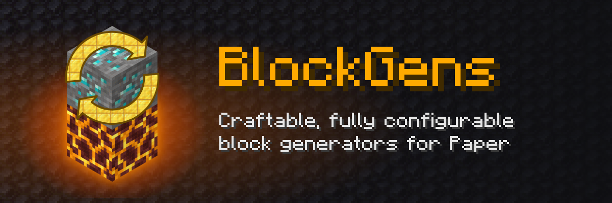

<div align="center">



Place a generator and it keeps a block of your choice above itself. Break that block and it comes back after a delay,
dropping items from a weighted drop table.

[](https://modrinth.com/plugin/blockgens)
[](https://hangar.papermc.io/andret2344/BlockGens)
[](https://github.com/andret2344/block-gens/releases/latest)
[](https://modrinth.com/plugin/blockgens/versions)

[](https://github.com/andret2344/block-gens/actions/workflows/build.yml)
[](https://codecov.io/gh/andret2344/block-gens)
[](https://papermc.io/software/paper)
[](https://adoptium.net/)
[](LICENSE)

[Download on Modrinth](https://modrinth.com/plugin/blockgens) ·
[Download on Hangar](https://hangar.papermc.io/andret2344/BlockGens) ·
[Report a bug](https://github.com/andret2344/block-gens/issues)

</div>

## Features

- **Any generator you want** - pick the generator block, the generated block, their names and lore, the delay and a
  weighted drop table, all in `config.yml`.
- **Crafted or sold** - give each generator its own crafting recipe, or leave it out and sell generators in a shop
  with `/bg give`, which works from the console.
- **Survives restarts** - placed generators are stored in the world's chunk data.
- **Explosions your way** - per generator, explosions can leave it alone, drop it like a regular block or destroy it.
- **Hard to break or abuse** - pistons cannot move generators, mobs cannot change them, nothing can be put in the
  spot of a re-spawning block, and region protection plugins are respected.
- **Friendly to admins** - [MiniMessage](https://docs.papermc.io/adventure/minimessage/format/) names and lore,
  `/bg reload` without a restart, and config errors that say exactly what is wrong and where.

## Installation

1. Download the jar from [Modrinth](https://modrinth.com/plugin/blockgens),
   [Hangar](https://hangar.papermc.io/andret2344/BlockGens) or
   [GitHub](https://github.com/andret2344/block-gens/releases/latest).
2. Put it into the `plugins` folder of a Paper (or Purpur) 26.2+ server running Java 25.
3. Start the server and edit `plugins/BlockGens/config.yml`, then run `/bg reload`.

## Commands and permissions

| Command                                  | Permission         | Description                                           |
|------------------------------------------|--------------------|-------------------------------------------------------|
| `/bg generator <generator>`              | `blockgens.get`    | Puts a generator block into the inventory             |
| `/bg generated <generated>`              | `blockgens.get`    | Puts a generated block into the inventory             |
| `/bg item <item>`                        | `blockgens.get`    | Puts a drop item into the inventory                   |
| `/bg give <player> <generator> [amount]` | `blockgens.give`   | Puts a generator block into the inventory of a player |
| `/bg reload`                             | `blockgens.reload` | Loads the config again                                |

`/bg` is an alias of `/blockgens`. All permissions are given to operators by default and are part of `blockgens.*`.

### Selling generators in a shop

`/bg give` works from the console, so any shop plugin that runs commands can sell generators:

```
bg give {player} sponge 5
```

The amount is optional, 1 by default and at most 2304 (a full inventory). Items that do not fit into the inventory are
dropped at the player's feet.

## Configuration

`config.yml` has three sections. `blocks` and `items` define named items, and `generators` puts them together:

```yaml
generators:
  sponge:                  # unique name, also the recipe name
    delay: 20              # ticks until the generated block comes back (20 ticks = 1 second), default 1
    blocks:
      generator: sponge    # from `blocks`, cannot be affected by gravity
      generated: stone     # from `blocks`
    drops:                 # optional, one is picked at random by weight when the generated block is broken
      bread:               # from `items`, keeps its name and lore
        weight: 3          # required, any positive number
        count: 1           # default 1
      apple:
        weight: 1
        count: 2
    crafting:              # optional, without it the generator can only be given with the command
      shape:
        - 'SSS'
        - 'SPS'
        - 'S S'
      mapping:
        'S': STONE
        'P': PISTON
    explosion:             # optional: prevent, drop or remove
      generator: drop      # default drop - dropped like a regular block
      generated: remove    # default remove - destroyed without a drop, comes back after the delay

blocks:
  sponge:
    material: SPONGE
    name: '<dark_purple>Creates food!'
    lore:
      - 'I will give you'
      - '<dark_red>MANY</dark_red> foodstuffs!'
  stone:
    material: STONE

items:
  bread:
    material: BREAD
  apple:
    material: APPLE
```

`/bg reload` keeps the current config when the new one is invalid and says what is wrong with it.

### How generators behave

- A generator placed under another block waits until that block is gone, then starts generating.
- While the generated block re-spawns, its spot is kept free: blocks, liquids, pistons and falling blocks cannot get in.
- Breaking a generator in survival or adventure mode drops it as an item; in creative it is just removed.
- Generators placed in a protected region follow the rules of the protection plugin.

## Building from source

```sh
./gradlew build
```

The plugin jar is `build/libs/BlockGens-<version>.jar`. The build runs the test suite (TestNG and MockBukkit) and
requires at least 80% test coverage.

## Metrics

BlockGens sends anonymous usage statistics to [bStats](https://bstats.org/plugin/bukkit/atsBlockGenerator/10330). They
can be turned off for all plugins in `plugins/bStats/config.yml`.

## License

Licensed under the [Apache License 2.0](LICENSE). If you redistribute this plugin or anything built from it, you have
to keep the contents of the [NOTICE](NOTICE) file, which links back to this repository.
